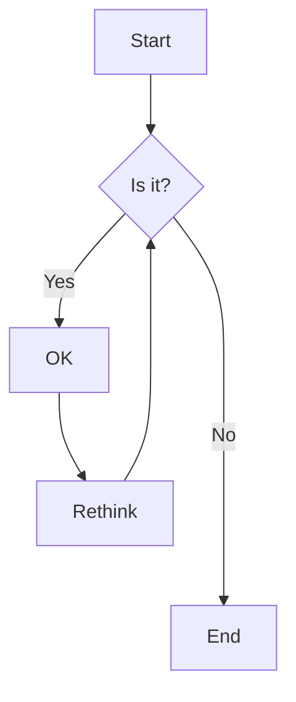



Hier ist ein Beispiel für Überschriften. Sie können diese Überschrift mit den folgenden Markdown-Regeln verwenden. Zum Beispiel: Verwenden Sie `#` für Überschrift 1 und `######` für Überschrift 6.

# Überschrift 1

## Überschrift 2

### Überschrift 3

#### Überschrift 4

##### Überschrift 5

###### Überschrift 6

<hr>

### Betonung

Die Betonung, auch Kursivschrift, mit _Sternchen_ oder _Unterstrichen_.

Starke Betonung, auch Fettschrift, mit **Sternchen** oder **Unterstrichen**.

Die kombinierte Betonung mit **Sternchen und _Unterstrichen_**.

Durchgestrichen verwendet zwei Tilden. ~~Streichen Sie das.~~

<hr>

### Button



<hr>

### Link

[Ich bin ein Inline-Link](https://www.google.com)

[Ich bin ein Inline-Link mit Titel](https://www.google.com "Googles Startseite")

[Ich bin ein relativer Verweis auf eine Repository-Datei](../blob/master/LICENSE)

URLs und URLs in spitzen Klammern werden automatisch in Links umgewandelt.
<http://www.example.com> oder <http://www.example.com> und manchmal
example.com (aber nicht auf Github zum Beispiel).

Ein Text, um zu zeigen, dass die Referenzlinks später folgen können.

<hr>

### Absatz

Lorem ipsum dolor sit amet consectetur adipisicing elit. Quam nihil enim maxime corporis cumque totam aliquid nam sint inventore optio modi neque laborum officiis necessitatibus, facilis placeat pariatur! Voluptatem, sed harum pariatur adipisci voluptates voluptatum cumque, porro sint minima similique magni perferendis fuga! Optio vel ipsum excepturi tempore reiciendis id quidem? Vel in, doloribus debitis nesciunt fugit sequi magnam accusantium modi neque quis, vitae velit, pariatur harum autem a! Velit impedit atque maiores animi possimus asperiores natus repellendus excepturi sint architecto eligendi non, omnis nihil. Facilis, doloremque illum. Fugit optio laborum minus debitis natus illo perspiciatis corporis voluptatum rerum laboriosam.

<hr>

### Geordnete Liste

1. Listenelement
2. Listenelement
3. Listenelement
4. Listenelement
5. Listenelement

<hr>

### Ungeordnete Liste

- Listenelement
- Listenelement
- Listenelement
- Listenelement
- Listenelement

<hr>

### Hinweis


Dies ist eine einfache Notiz.



Dies ist ein einfaches Zitat.



Dies ist ein einfacher Tipp.



Dies ist eine einfache Info.



Dies ist eine einfache Warnung.


<hr>

### Tab




#### Hallo, ich bin ein Tab

Lorem ipsum dolor sit amet, consetetur sadipscing elitr, sed diam nonumy eirmod tempor invidunt ut labore et dolore magna aliquyam erat, sed diam voluptua. At vero eos et accusam et justo duo dolores et ea rebum. Stet clita kasd gubergren, no sea takimata sanctus est Lorem ipsum dolor sit amet.





#### Ich möchte über den Attentatsversuch sprechen

Lorem ipsum dolor sit amet, consetetur sadipscing elitr, sed diam nonumy eirmod tempor invidunt ut labore et dolore magna aliquyam erat, sed diam voluptua. At vero eos et accusam et justo duo dolores et ea rebum. Stet clita kasd gubergren, no sea takimata sanctus est Lorem ipsum dolor sit amet.

Lorem ipsum dolor sit amet, consetetur sadipscing elitr, sed diam nonumy eirmod tempor invidunt ut labore et dolore magna aliquyam erat, sed diam voluptua. At vero eos et accusam et justo duo dolores et ea rebum. Stet clita kasd gubergren, no sea takimata sanctus est Lorem ipsum dolor sit amet.





#### Wir wissen, dass Sie mit gestohlenem Erz handeln

Lorem ipsum dolor sit amet, consetetur sadipscing elitr, sed diam nonumy eirmod tempor invidunt ut labore et dolore magna aliquyam erat, sed diam voluptua. At vero eos et accusam et justo duo dolores et ea rebum. Stet clita kasd gubergren, no sea takimata sanctus est Lorem ipsum dolor sit amet.

Lorem ipsum dolor sit amet, consetetur sadipscing elitr, sed diam nonumy eirmod tempor invidunt ut labore et dolore magna aliquyam erat, sed diam voluptua. At vero eos et accusam et justo duo




<hr>

### Akkordeons



- Lorem ipsum dolor sit amet consectetur adipisicing elit.
- Lorem ipsum dolor sit amet consectetur adipisicing elit.
- Lorem ipsum dolor sit amet consectetur





- Lorem ipsum dolor sit amet consectetur adipisicing elit.
- Lorem ipsum dolor sit amet consectetur adipisicing elit.
- Lorem ipsum dolor sit amet consectetur





- Lorem ipsum dolor sit amet consectetur adipisicing elit.
- Lorem ipsum dolor sit amet consectetur adipisicing elit.
- Lorem ipsum dolor sit amet consectetur



<hr>

### Code und Syntax-Hervorhebung

Dies ist ein `Inline Code` Beispiel.

```javascript
var s = "JavaScript syntax highlighting";
alert(s);
```

```python
s = "Python syntax highlighting"
print s
```

```c { linenos=true }
#include <stdio.h>

int main(void)
{
    printf("hello, world\n");
    return 0;
}
```



<hr>

### Zitatblock

> Sind Sie wegen etwas Bestimmtem hierhergekommen oder nur zum allgemeinen Riker-Bashing? Und als Sie in maximale Warpgeschwindigkeit gingen, schienen Sie für einen Augenblick an zwei Orten gleichzeitig zu sein.

<hr>

### Tabellen

| Tabellen      |     Sind     |  Cool |
| ------------- | :----------: | ----: |
| Spalte 3 ist  | rechtsbündig | $1600 |
| Spalte 2 ist  |  zentriert   |   $12 |
| Zebrastreifen |  sind toll   |    $1 |

<hr>

### Bild



<hr>

### Galerie



<hr>

### Slider



<hr>

### Youtube Video



<hr>

### Benutzerdefiniertes Video


